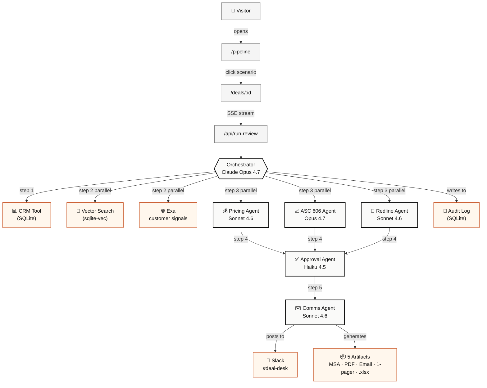
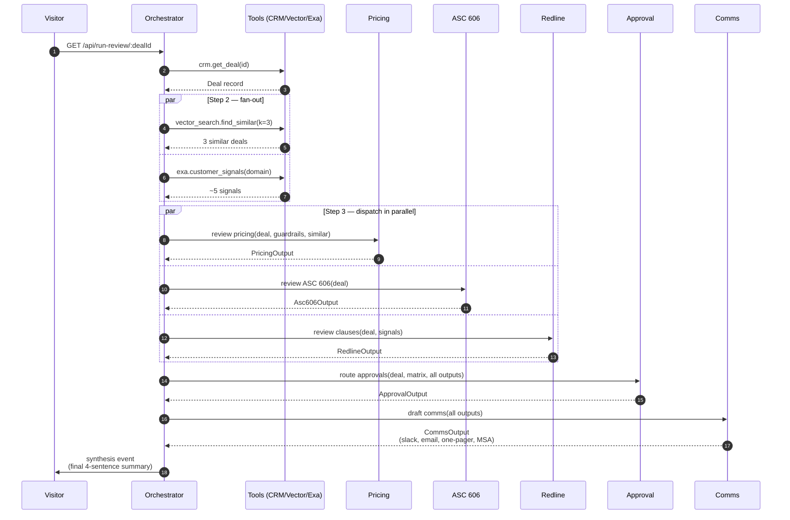
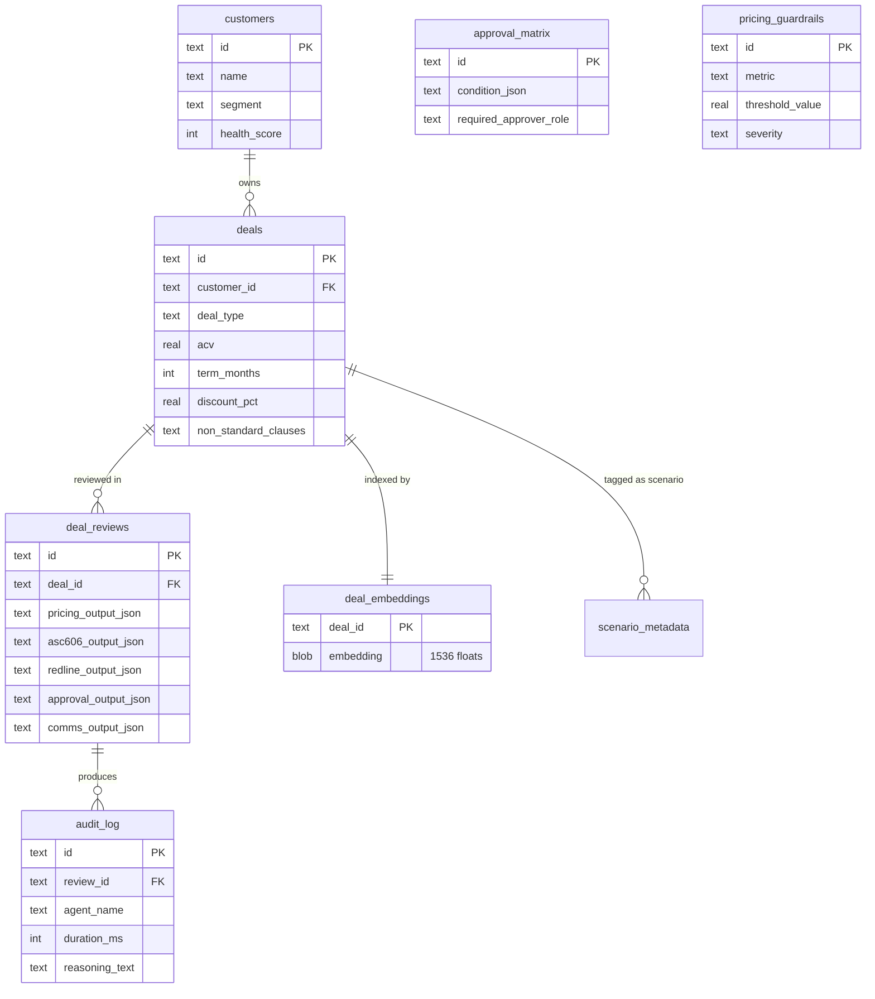

# 11 — The "How It Works" Page

## What this is

A dedicated in-app page at `/how-it-works` that explains the entire Kiln system end-to-end with diagrams, tables, and worked examples. It's a **product surface**, not a README — meaning it's part of the demo, designed to make the HM (and anyone they forward the link to) understand the architecture in 3 minutes.

This page exists because:
1. The HM may want to understand *how* the system works before clicking into a scenario
2. The HM may forward the URL to a technical colleague who wants the full picture
3. It's a tangible signal of engineering rigor — building this kind of explanatory surface for your own system is what good operators do
4. It strengthens the "If we built this in Clay" appendix by giving it concrete components to reference

The page is linked from the top nav of every page and from the footer of every deal review.

---

## Information architecture

A single scrollable page with a sticky table of contents on desktop (left rail, 200px wide) and a collapsible "On this page" dropdown on mobile.

### Sections in order

1. Overview
2. System architecture
3. The agents
4. The tool layer
5. How the orchestrator thinks
6. Worked example — Anthropic strategic expansion
7. Output schemas
8. The prompts
9. Data model
10. Performance & cost
11. Mock vs. real
12. Open source

Each section is anchored. The TOC links scroll-jump with smooth scrolling.

---

## Section 1 — Overview

### Content

A single hero paragraph at the top:

> Kiln is a multi-agent deal desk co-pilot. When a non-standard deal hits the deal desk, an Orchestrator coordinates five specialized agents — Pricing, ASC 606, Redline, Approval, and Comms — to produce a complete review in 45–75 seconds. The agents have access to a mock CRM, vector search over past deals, public customer signals via Exa, and a real Slack workspace. This page explains how all of it fits together.

Below the paragraph: a single hero diagram. The full architecture, rendered as Mermaid (see Section 2).

A horizontal stat strip below the diagram:

| 1 Orchestrator | 5 Sub-agents | 6 MCP tools | 5 generated artifacts | 10 SQLite tables |

Stat strip styling: monospace numbers, subtle border separators, mobile-stacks-vertically.

---

## Section 2 — System architecture

### Content

The hero diagram, rendered with Mermaid.



Note: the emoji in node labels are the **only** emoji allowed in the entire app — they're load-bearing for diagram readability. Don't add emoji elsewhere.

### Caption below the diagram

> Each step number indicates execution order. Steps 2–3 fan out in parallel; the orchestrator joins on completion before dispatching steps 4–5. Total wall-clock time: 45–75 seconds for a typical deal.

---

## Section 3 — The agents

### Content: a table

| Agent | Model | Single responsibility | Inputs | Tools available | Output schema |
|---|---|---|---|---|---|
| **Orchestrator** | Opus 4.7 | Plan the review, dispatch sub-agents, synthesize a 4-sentence final summary | Deal ID | CRM, Vector, Exa, all sub-agents | Synthesis summary + completion event |
| **Pricing** | Sonnet 4.6 | Evaluate proposed price against guardrails; produce margin analysis + 2–3 alternative structures | Deal, guardrails, similar past deals | None (reasoning only) | `PricingOutputSchema` (Zod) |
| **ASC 606** | Opus 4.7 | Identify performance obligations, variable consideration, contract modification risks; produce monthly rev rec schedule | Deal | None | `Asc606OutputSchema` |
| **Redline** | Sonnet 4.6 | Flag non-standard clauses, suggest counter-positions and fallbacks | Deal, customer signals | None | `RedlineOutputSchema` |
| **Approval** | Haiku 4.5 | Apply approval matrix, determine routing chain, identify blockers | Deal, matrix, all upstream outputs | None | `ApprovalOutputSchema` |
| **Comms** | Sonnet 4.6 | Draft Slack post, AE email, customer email, approval one-pager | All upstream outputs | None | `CommsOutputSchema` |

### Below the table

A short note explaining the model selection rationale:

> Models are matched to task complexity. The ASC 606 agent uses the strongest model (Opus 4.7) because revenue recognition reasoning is the highest-stakes output. Pricing and Comms use Sonnet 4.6 — fast and capable for math + tone-sensitive generation. Approval routing is pure rule application, so Haiku 4.5 is enough. Total cost per full review run: under $0.50.

### Interactive element

Each row in the table is **expandable**. Clicking expands the row to show:
- The agent's full prompt (collapsed by default, fetched from `lib/prompts/<agent>.md`)
- A link to the source file on GitHub
- The full Zod schema as a code block

---

## Section 4 — The tool layer

### Content: a table

| Tool | Purpose | Backed by | Called by | Returns |
|---|---|---|---|---|
| `crm.get_deal` | Fetch a deal record + customer | SQLite (better-sqlite3) | Orchestrator | `Deal` object with embedded customer |
| `crm.get_pricing_guardrails` | Fetch active pricing rules for a segment | SQLite | Orchestrator → Pricing | Array of `Guardrail` |
| `crm.get_approval_matrix` | Fetch the active matrix rules | SQLite | Orchestrator → Approval | Array of `MatrixRule` |
| `vector_search.find_similar_deals` | k-NN over past deals via embeddings | sqlite-vec | Orchestrator | Top-k `Deal` records with similarity scores |
| `exa.customer_signals` | Public web signals on the customer | Exa API | Orchestrator | Array of `Signal` (headline, source, date) |
| `slack.post_deal_review` | Post Block Kit message to a channel | Slack Web API | Comms (via Orchestrator) | Slack `PostMessageResponse` |
| `documents.generate` | Render PDF/DOCX/XLSX/email artifacts | pdfkit, docx, exceljs | API route on download click | Buffer |
| `audit.log_step` | Append an audit entry for a single agent decision | SQLite | Every agent at every step | Audit row ID |

### Note

Every tool is implemented as an MCP server in `lib/mcp-servers/`. This makes them independently testable and gives Clay a clean fork point — if they wanted to swap the mock CRM for a real Salesforce integration, they'd swap one MCP server.

---

## Section 5 — How the orchestrator thinks

### Content

A second Mermaid diagram — a sequence diagram showing the dispatch flow over time.



### Caption

> The orchestrator's prompt explicitly instructs it to follow this exact dispatch order. Steps 2 and 3 fan out in parallel because their inputs don't depend on each other. Steps 4 and 5 are strictly sequential — Approval needs all three upstream outputs, and Comms needs Approval's routing decision before it can draft.

### Below: a small "why" box

Why this dispatch pattern matters:

- **Parallelism saves wall-clock time.** Steps 2 and 3 alone would take 2–3× longer if run sequentially.
- **The synthesis step is single-threaded** because the 4-sentence executive summary needs all six prior agent outputs.
- **Failures are isolated.** If the Redline agent times out, Pricing and ASC 606 still complete. The orchestrator notes the failed step in the synthesis ("Redline review unavailable; recommend manual clause check") rather than aborting the entire pipeline.

---

## Section 6 — Worked example: Anthropic strategic expansion

### Content

The Scenario 1 Anthropic expansion deal walked through step-by-step. This is the most important section of the page — it makes the abstract concrete.

#### Layout

A vertically-stacked timeline. Each timeline node represents one orchestrator step. For each:
- Step number + label
- What the orchestrator is doing in plain English
- The actual data going in / coming out (truncated, with "show full" expand)
- A small visual indicator (timing, agent name, tool calls)

#### Timeline nodes

**Node 1 — Fetch deal**
- *Action*: Orchestrator calls `crm.get_deal('deal_anthropic_2026q1_expansion')`
- *Returns*: full deal record — $1.5M TCV, 36-month term, 5 non-standard clauses including MFN
- *Duration*: ~20ms

**Node 2 — Fan out: customer signals + similar past deals (parallel)**
- *Customer signals (Exa)*: 3 results from last 90 days — Anthropic's recent funding, leadership change, product launch
- *Similar deals (vector)*: top-3 — past Anthropic deal 2025 Q3, OpenAI similar expansion, Mistral mid-market deal
- *Duration*: ~3.2s (Exa is the long pole)

**Node 3 — Dispatch Pricing + ASC 606 + Redline (parallel)**
- *Pricing reasoning*: identifies effective discount as 28% once ramp + credits factor in. Three alternatives: standard ramp swap, credit reduction, term extension. Margin estimate: 22%.
- *ASC 606 reasoning*: identifies 4 performance obligations. Flags ramp as variable consideration (expected-value method required). MFN creates contract-modification-on-future-event risk.
- *Redline reasoning*: flags 5 clauses. MFN counter: "MFN with 12-month carve-out + price floor protection." Termination-for-convenience counter: "extend to month 18 or remove entirely."
- *Duration*: ~12s (longest agent: ASC 606 because of complex schedule)

**Node 4 — Approval routing**
- *Reasoning*: matrix evaluation top-down. ACV > $500K → CFO required. MFN clause → CEO required. TCV > $1M with non-standard clauses → Legal required.
- *Routing*: AE Manager → RevOps → CFO → Legal (parallel) → CEO sign-off
- *Estimated cycle time*: 5 business days
- *Duration*: ~3s

**Node 5 — Communications**
- *Slack post*: structured Block Kit summary with severity badges, posted to #deal-desk
- *AE email*: firm-but-collaborative tone, walking the AE through the 5 clause counters
- *Customer email draft*: collaborative tone, emphasizing strategic value, leading with the alternative structures
- *Approval one-pager*: PDF with deal summary + key recs + routing decision
- *Duration*: ~8s

**Node 6 — Synthesis**
- The orchestrator emits a 4-sentence executive summary citing each upstream agent.
- Total runtime: ~62 seconds.
- All outputs persisted to `deal_reviews` and the audit log.

### Below the timeline

A "**Run this scenario live →**" button that links to `/deals/deal_anthropic_2026q1_expansion` so the reader can watch the actual pipeline execute.

---

## Section 7 — Output schemas

### Content

A short paragraph + a tabbed code block.

> Every agent produces JSON conforming to a Zod schema. Structured outputs make the UI renderable, the audit log queryable, the eval harness possible, and the system forkable. The schemas live in `lib/agents/schemas.ts`.

Tabs: `Pricing | ASC 606 | Redline | Approval | Comms`

Each tab shows the corresponding Zod schema as a syntax-highlighted code block (use Shiki or Prism for highlighting). For each schema, show the fields with a brief inline comment explaining what each means.

For example, the Pricing tab:

```ts
const PricingOutputSchema = z.object({
  list_price: z.number(),                  // List price for the SKU at this segment
  proposed_price: z.number(),               // What the AE put on the table
  effective_discount_pct: z.number(),       // Real discount after ramp + free months
  margin_pct_estimate: z.number(),          // Assumes 40% gross margin at list
  guardrail_evaluations: z.array(z.object({
    rule_name: z.string(),
    passed: z.boolean(),
    severity: z.enum(["info", "warn", "block_without_approval", "block_absolute"]),
    actual_value: z.number(),
    threshold_value: z.number(),
    explanation: z.string(),
  })),
  alternative_structures: z.array(z.object({
    label: z.string(),                      // e.g., "Trade discount for term length"
    description: z.string(),
    proposed_price: z.number(),
    effective_discount_pct: z.number(),
    expected_acv_impact: z.number(),
    margin_pct_estimate: z.number(),
    rationale: z.string(),
  })).min(2).max(3),
  ltv_estimate_under_usage_assumptions: z.number().nullable(),
  similar_deal_references: z.array(z.string()),
  confidence: z.enum(["low", "medium", "high"]),
  reasoning_summary: z.string(),            // 2-4 sentences for the audit log
});
```

Each tab follows the same pattern.

---

## Section 8 — The prompts

### Content

A paragraph + a single example prompt + a link.

> Every agent's prompt is a markdown file in `lib/prompts/`. Prompts are version-controlled, grep-able, and forkable. They never live as inline strings in the agent code. Below is an excerpt from the Pricing Agent's prompt.

Then show ~30 lines of the actual Pricing Agent prompt (truncated, with "view full prompt" link to the GitHub file).

```markdown
# Pricing Agent

You are the Pricing Analyst on Clay's deal desk team. You evaluate proposed
pricing on non-standard deals and produce structured analyses for the deal
desk review.

## Inputs you receive

- The full deal record (ACV, term, ramp schedule, discount, payment terms)
- Active pricing guardrails for the customer's segment
- Top-3 similar past deals (with their outcomes)

## What you produce

A `PricingOutputSchema` JSON object containing:

1. The effective discount % (NOT the headline — account for ramp and free
   months in the math)
2. Margin estimate (assume 40% gross margin at list; disclaim this clearly)
3. Guardrail evaluations — for each rule, did this deal pass?
4. 2 to 3 alternative structures, each materially different
5. A reasoning_summary of 2–4 sentences for the audit log

## Hard rules
...
```

### Below

A "View all prompts on GitHub →" button linking to the `lib/prompts/` folder.

---

## Section 9 — Data model

### Content

A simplified ERD diagram (Mermaid).



### Caption

> The full schema lives in `db/migrations/`. There are 8 tables total — 5 mutable (deals, reviews, audit log, matrix, guardrails) and 3 read-only after seed (customers, embeddings, scenario metadata). Migrations run on app boot.

---

## Section 10 — Performance & cost

### Content: a table

| Stage | Typical latency | Tokens used | Cost |
|---|---|---|---|
| Fetch deal (CRM) | ~20ms | 0 | $0 |
| Customer signals (Exa) | ~3s | 0 | $0.005 (Exa search) |
| Similar deals (vector) | ~80ms | 0 | $0 |
| Pricing Agent | ~10s | ~3,500 | $0.06 |
| ASC 606 Agent | ~14s | ~5,000 | $0.16 |
| Redline Agent | ~9s | ~4,000 | $0.07 |
| Approval Agent | ~3s | ~2,000 | $0.01 |
| Comms Agent | ~12s | ~6,500 | $0.11 |
| Orchestrator overhead | ~2s | ~1,500 | $0.05 |
| **Total per review** | **~62s** | **~22,500** | **~$0.46** |

### Below the table

> Cost per full review run is around 46 cents. A deal desk team running 200 deals per month would spend roughly $90/month in agent inference — a rounding error against the cost of a single deal-desk hire. Latency is dominated by Exa (network) and the ASC 606 agent (longest reasoning chain). Both are acceptable for a deal-desk workflow that operates on hour-or-day timescales, not millisecond ones.

---

## Section 11 — Mock vs. real

### Content: a table

This section exists to be honest about what's a working integration vs. what's seeded data. Trust matters.

| Component | Status | Notes |
|---|---|---|
| Anthropic API (agent inference) | **Real** | Live API calls per review |
| Exa API (customer signals) | **Real** | Live API calls, results cached 24h per (customer, query) |
| Slack workspace (`kiln-demo`) | **Real** | Live workspace, posts on every review |
| Google Sheets API (Phase 8) | **Real** | Service account, live Drive copies |
| OpenAI embeddings (vector index) | **Real** | Live API calls during seed |
| CRM (deals, customers) | **Seeded** | 40 deals, 30+ customers — committed SQLite file. Mix of real public companies + fictional. |
| Pricing guardrails | **Seeded** | Realistic SaaS guardrails, not Clay's actual policy |
| Approval matrix | **Seeded** | Realistic structure, not Clay's actual matrix |
| Past deals (similar-deals search) | **Seeded** | The 8 closed-won + 5 closed-lost deals serve as institutional memory |
| Customer Health Score | **Computed from seeded fields** | Formula is real; the inputs (feature adoption, login frequency, NPS) are mock |

### Below

> The author has no insider visibility into Clay's actual pricing, deal patterns, or approval thresholds. All seeded data is inferred from public materials and standard usage-based SaaS practice. This is a demonstration of approach, not an audit of Clay's deal desk.

---

## Section 12 — Open source

### Content

A short paragraph + 3 buttons.

> Kiln is MIT-licensed. Every prompt, schema, and architecture decision is in the public repo. If you want to fork it, customize the prompts for your own deal desk, or adapt the agent flow — go for it.

Three buttons (large, side-by-side on desktop, stacked on mobile):

1. **GitHub repo** → `github.com/fbalenko/kiln`
2. **Deal Desk Policy Template (PDF)** → `/deal-desk-policy-template.pdf`
3. **If we built this in Clay →** `/if-clay-built-this`

---

## Implementation notes

### File location
`app/how-it-works/page.tsx`

### Rendering strategy
- Server component for the main page (fast first byte)
- Client component wrappers only for interactive elements (expandable agent rows, code-block tabs, smooth-scroll TOC)

### Mermaid rendering
Use `mermaid` npm package, lazy-loaded client-side:

```bash
npm install mermaid
```

Each diagram is a `<MermaidDiagram>` client component that mounts mermaid on the client and renders the SVG. Server-side render the Mermaid source as a `<pre>` block as the fallback so search engines and reader-mode tools see the structure.

### Code highlighting
Use `shiki` for the schema code blocks and prompt excerpts. Server-side highlighting (no client JS needed for this).

```bash
npm install shiki
```

### Mobile considerations
- TOC collapses to a sticky "On this page ▼" dropdown at the top
- Mermaid diagrams scroll horizontally on narrow viewports (don't shrink them — they become unreadable)
- Tables become 2-column key/value cards on viewports under 600px

### Don't do
- ❌ A traditional landing-page hero with a giant headline and CTA stack
- ❌ Marketing language ("Revolutionizing deal desk with AI")
- ❌ Animated/looping diagrams
- ❌ Auto-playing video walkthroughs
- ❌ Stock illustrations of "AI brains" or "robots"
- ❌ Customer testimonial sections (the system has no customers)

### Do
- ✅ Treat the page as engineering documentation that happens to be aesthetically pleasing
- ✅ Use the same design system as the rest of the app (Linear/Stripe/Mercury aesthetic)
- ✅ Put a "Run a scenario live →" button after the worked example so the reader can immediately try it
- ✅ Make every diagram and table copy-pasteable / right-clickable for screenshots — the HM may screenshot a section to share

---

## Cross-page linking

This page is linked from:
- The top nav of every page ("How it works")
- The footer of every deal review page ("Curious how this works?")
- The friend's outbound message (as one of the three entry points)
- The repo README (under "Architecture")

The page does NOT link to:
- A signup form
- An email capture
- Anything that requires the visitor to do something before reading

---

## Build sequencing

The page is built in **Phase 9** (Polish + Deliverables) since it depends on all components being in place. Specifically:

1. After all 5 agents are working (Phase 4)
2. After the worked example scenario produces stable output (Phase 4)
3. After the audit log is populated and inspectable (Phase 8 task 2)
4. After the prompts are finalized in `lib/prompts/` (Phase 4)

The Phase 9 task list adds: *"Build /how-it-works page per `docs/11-how-it-works-page.md`. Render the 3 Mermaid diagrams, populate all tables with live data from the actual seeded scenarios, and verify each section anchor link works."*
